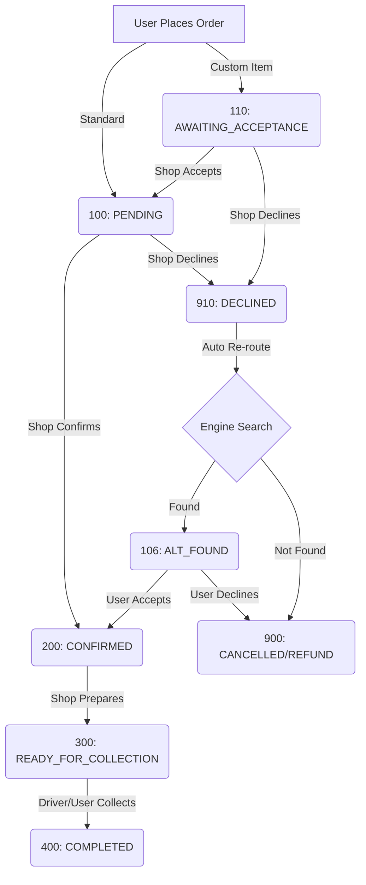

# KithLy Global Protocol 🌍🎁

> **Technical Architecture & Engineering Documentation**
> 
> *Aeronautical-Grade Global Gifting Protocol*

---

## 1. Executive Summary

**KithLy** is a hyperlocal logistics and gifting protocol designed to facilitate seamless cross-border gifting with local fulfillment. It solves the "last-mile trust" problem in African markets by combining a rigorous shop verification system with an intelligent re-routing engine.

The system is built on a four-layer architecture ("Bedrock", "Engine", "Gateway", "Skin") ensuring separation of concerns between data integrity, core logic, API services, and user experience.

---

## 2. System Architecture (The "Four Layers")

### Layer 1: The Bedrock (Data)
*   **Technology**: PostgreSQL 16 + PostGIS
*   **Role**: Single Source of Truth, ACID compliance, Geospatial indexing.
*   **Key Schemas**:
    *   `Global_Gifts`: The central ledger of all transactions.
    *   `Shops`: Detailed shop profiles with performance metrics.
    *   `Inventory_Locks`: Redis-style temporary reservations for race-condition prevention.

### Layer 2: The Engine (Intelligence)
*   **Technology**: C++17 (High Performance)
*   **Role**: The "Brain" of the operation. Handles complex, time-critical logic.
*   **Components**:
    *   `orchestrator`: Manages state transitions and the re-routing engine.
    *   `rerouter`: Executes <50ms geospatial queries to find alternative fulfillment partners.
    *   `baker`: State machine for "Made-to-Order" workflows (Status 110).

### Layer 3: The Gateway (Services)
*   **Technology**: Python (FastAPI/Scripts)
*   **Role**: The API layer interacting with the outside world.
*   **Services**:
    *   `currency_oracle`: Zone-based pricing (K50/K100/K220) and FX normalization.
    *   `analytics`: Shop performance scoring (0-100) and tiering.
    *   `push`: Notification dispatcher (FCM) for critical status updates.
    *   `admin`: "God Mode" endpoints for platform oversight.

### Layer 4: The Skin (Interface)
*   **Technology**: Flutter (Dart)
*   **Role**: Cross-platform mobile application (iOS/Android) and Web Admin.
*   **Design System**: "Project Alpha" - Glassmorphism, Soft Shadows, Orange (#F85A47) & Gold (#DAA520) palette.

---

## 3. Core Protocols & Features

### 3.1. Smart Re-routing "Failover"
If a shop declines an order (Status 910), the **Engine** immediately triggers a proximity search:
1.  **Search**: PostGIS query for verified shops within 5km radius offering the same category.
2.  **Lock**: "Shadow Lock" inventory at the new shop to prevent overselling.
3.  **Update**: Transition order to Status 106 (`ALT_FOUND`).
4.  **Notify**: Customer receives a push notification to confirm the switch.
*   *Performance Target: < 50ms*

### 3.2. Baker's Protocol (Made-to-Order)
For custom items (Cakes, Flowers):
1.  Order is placed → Status 110 (`AWAITING_SHOP_ACCEPTANCE`).
2.  Funds are authorized but **not captured**.
3.  Shop receives a "Bell" notification.
4.  Shop Accepts → Status 200 (`CONFIRMED`) → Funds Captured.
5.  Shop Declines → Status 910 (`DECLINED`) → Auth Voided.

### 3.3. Zone-Based Pricing
Delivery fees are calculated based on Haversine distance from Shop to Recipient:
*   **Zone A (0-5km)**: K50
*   **Zone B (5-15km)**: K100
*   **Zone C (15km+)**: K220

### 3.4. Shop Tiers & Scoring
Shops are dynamically scored (0-100) based on:
*   Completion Rate (35%)
*   ZRA Tax Compliance (25%)
*   Customer Rating (25%)
*   Response Time (15%)

**Tiers:**
*   **Select (85+)**: Premium visibility, lower fees.
*   **Verified (65-85)**: Standard access.
*   **Independent (40-65)**: Basic listing.
*   **Sandbox (0-40)**: Probationary/Training mode.

---

## 4. Data Flow (Status Codes)



---

## 5. Technical Stack & Dependencies

### Backend
*   **Language**: Python 3.9+, C++17
*   **Database**: PostgreSQL 16 (with PostGIS extension)
*   **Libraries**: `fastapi`, `asyncpg`, `pydantic`, `libpqxx` (C++)
*   **External APIs**:
    *   Stripe (Payments)
    *   Flutterwave (Disbursement)
    *   Firebase (Auth & Cloud Messaging)
    *   Google Maps/Places (Geocoding)
    *   ZRA VSDC (Fiscalization)

### Frontend
*   **Framework**: Flutter 3.x
*   **State Management**: Provider
*   **Maps**: `google_maps_flutter`
*   **Charts**: `fl_chart`

---

## 6. Directory Structure

```
kithly-global-protocol/
├── 01_bedrock/          # SQL Schemas & Migrations
│   └── schema/          # 001_initial... to 006_grand_unification.sql
├── 02_engine/           # C++ Core Logic
│   └── src/             # orchestrator.cpp
├── 03_gateway/          # Python API Services
│   ├── api/             # FastAPI Endpoints
│   └── services/        # Business Logic (analytics.py, push.py, etc.)
├── 04_skin/             # Flutter App
│   ├── lib/
│   │   ├── config/      # Feature Flags
│   │   ├── screens/     # UI Views
│   │   └── theme/       # Alpha Theme (Design System)
│   └── pubspec.yaml
├── docs/                # Architecture Documentation
└── README.md            # You are here
```

---

## 7. Setup & Installation

### Prerequisites
*   PostgreSQL 16+
*   Python 3.9+
*   Flutter SDK
*   C++ Compiler (g++ / clang)

### Environment
1.  **Frontend**: Cop `04_skin/.env.example` to `04_skin/.env` and populate keys.
2.  **Backend**: Copy `03_gateway/.env.example` to `03_gateway/.env` and populate keys.

### Running the System
1.  **Database**: Run SQL scripts in `01_bedrock/schema/` in order.
2.  **Engine**: Compile and run `orchestrator`.
    ```bash
    g++ -O3 -std=c++17 02_engine/src/orchestrator.cpp -lpqxx -lpq -o orchestrator
    ./orchestrator
    ```
3.  **Gateway**: Start the Python API.
    ```bash
    cd 03_gateway
    uvicorn main:app --reload
    ```
4.  **Skin**: Launch the Flutter app.
    ```bash
    cd 04_skin
    flutter run
    ```
